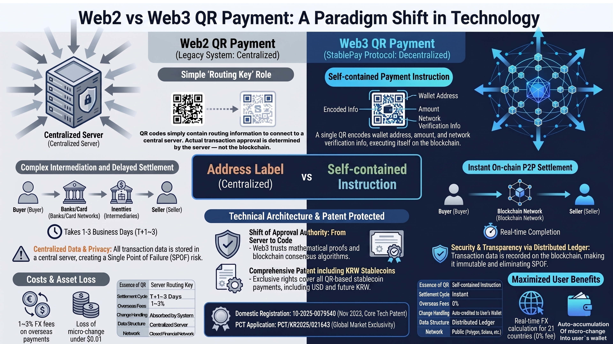

# Web2 QR vs Web3 QR: Architectural Differences

From Routing Keys to Self-Contained Transaction Instructions

---

## Overview

This repository explores architectural differences between traditional QR payment systems and distributed transaction execution.

---

## Architecture

Web2:

QR → Request → Server → Decision

Web3:

QR → Instruction → Verification → Execution

---

## Documents

- [QR Evolution](docs/qr-overview.md)

- [Web2 Architecture](docs/web2-architecture.md)

- [Web3 Architecture](docs/web3-architecture.md)

---

## License

MIT
